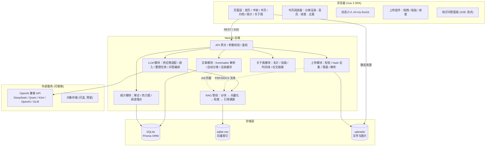
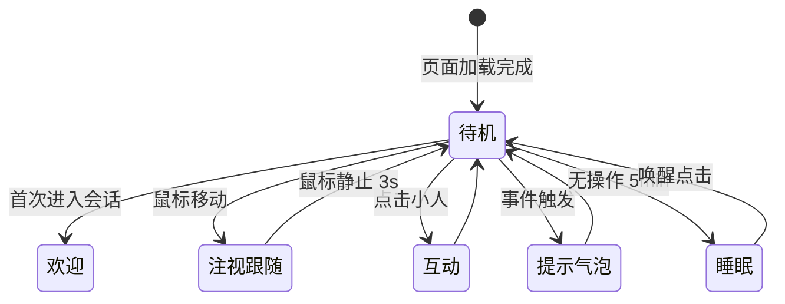
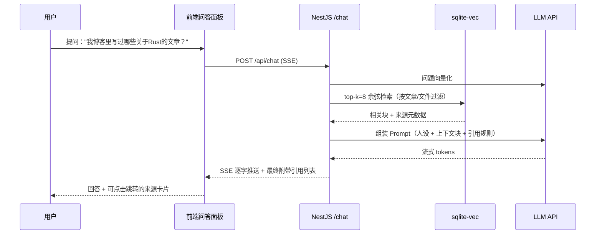
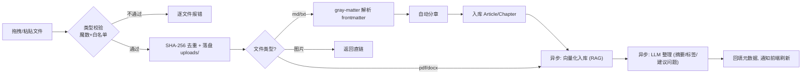

# 个人博客框架设计文档

> 项目代号：MyBlog · 一份"像书一样"的个人博客
> 版本：v0.1（设计稿） · 状态：待评审

---

## 目录

1. [项目概述](#1-项目概述)
2. [核心需求拆解](#2-核心需求拆解)
3. [技术选型](#3-技术选型)
4. [总体架构](#4-总体架构)
5. [模块详细设计](#5-模块详细设计)
6. [数据模型设计](#6-数据模型设计)
7. [API 设计](#7-api-设计)
8. [目录结构](#8-目录结构)
9. [页面与交互设计](#9-页面与交互设计)
10. [关键流程](#10-关键流程)
11. [非功能需求](#11-非功能需求)
12. [分阶段实施路线图](#12-分阶段实施路线图)
13. [风险与注意事项](#13-风险与注意事项)

---

## 1. 项目概述

### 1.1 定位

一个**个人知识型博客**，既是写作发布平台，也是个人知识库。核心体验对标"主流小说阅读平台的书页"——把每一篇文章当作一本书的章节来阅读。

### 1.2 目标

- 用 Markdown 写作，上传即发布，代码自动高亮
- 阅读体验向小说平台看齐（纸张质感、章节导航、阅读进度、字体调节）
- 一个"有灵魂"的动态小人常驻页面，陪伴阅读
- 接入主流 LLM API，实现**文件整理**与**知识问答**（RAG）
- 通过多个快捷入口完成自我介绍
- 可视化统计提交的文章与写作数据

### 1.3 设计原则

| 原则 | 说明 |
|------|------|
| 上传即发布 | Markdown 文件上传后自动解析 frontmatter、分章、入库 |
| 书页优先 | 所有文章默认以书页布局阅读，而非传统博客列表 |
| 渐进增强 | 动态小人、LLM 问答为增强能力，缺失时不影响核心功能 |
| 可替换性 | LLM 供应商通过统一抽象接入，可热切换 |
| 单机可部署 | 个人场景优先，SQLite + 本地文件即可跑通，可平滑升级 |

---

## 2. 核心需求拆解

| # | 需求 | 拆解 | 优先级 |
|---|------|------|--------|
| R1 | 文件上传功能 | 拖拽/粘贴/批量上传、类型校验、进度显示、md/pdf/docx/图片 | P0 |
| R2 | Markdown 适配 + 代码高亮 | markdown-it 渲染 + highlight.js 高亮，支持 GFM/frontmatter/目录 | P0 |
| R3 | 书页布局 | 纸张背景、衬线字体、章节导航、目录抽屉、阅读进度、字体调节、主题切换 | P0 |
| R4 | 动态小人 | Live2D/精灵动画小人，待机/跟随/点击互动，与阅读场景联动 | P1 |
| R5 | LLM 接入 | 文件自动整理（摘要/标签/归类）+ 知识问答（RAG 流式回答） | P1 |
| R6 | 自我介绍快捷入口 | 全局"关于我"气泡、导航入口、快捷键、个人名片卡 | P1 |
| R7 | 文章统计 | 提交数、字数、标签分布、发布热力图、阅读量统计 | P1 |

---

## 3. 技术选型

### 3.1 推荐方案（主选）

| 层 | 技术 | 选型理由 |
|----|------|----------|
| 前端框架 | **Vue 3 + TypeScript + Vite** | 组合式 API 适合复杂交互（书页、小人），生态成熟 |
| 状态管理 | Pinia | Vue 3 官方推荐 |
| UI 方案 | Tailwind CSS + 自定义设计令牌 | 书页质感需要高度自定义，原子化 CSS 最灵活 |
| Markdown | **markdown-it** + markdown-it-anchor + markdown-it-toc-done-right | 轻量、插件丰富、可控性高 |
| 代码高亮 | **highlight.js**（vs2015 / atom-one-dark 主题） | 需求指定；运行时高亮，支持 190+ 语言 |
| 图表 | ECharts | 统计热力图、柱状图、饼图一站式 |
| 后端 | **NestJS + TypeScript** | 模块化架构清晰，适合上传/LLM/统计多模块 |
| ORM | Prisma | 类型安全，迁移方便 |
| 数据库 | **SQLite**（better-sqlite3），预留 PostgreSQL 升级路径 | 个人博客单机部署最简，Prisma 切换成本低 |
| 向量检索 | **sqlite-vec** 扩展 | 与 SQLite 同库同进程，个人知识库规模完全够用 |
| 文件存储 | 本地磁盘 `uploads/`，预留 S3/OSS 适配层 | 简单可控，接口抽象后平滑升级 |
| 文件解析 | gray-matter（frontmatter）、pdf-parse、mammoth（docx） | 轻量成熟 |
| LLM 接入 | openai 官方 SDK + OpenAI 兼容协议抽象 | 一套协议通吃 DeepSeek / Qwen / Kimi / OpenAI / GLM |
| 动态小人 | **oh-my-live2d**（免费 Live2D 模型），备选纯 CSS/SVG 自绘精灵 | 主流方案，加载快，交互 API 完善 |
| 部署 | Docker Compose + Caddy（自动 HTTPS） | 单机一条命令起服务 |

### 3.2 备选方案

- **Next.js 全栈**：前端想用 React 时的首选，API Routes + Server Components 可合并前后端，但 RAG/上传等长任务进程模型略复杂。
- **Python FastAPI 后端**：若未来想接本地模型/更重的 NLP（如 bge-m3 本地嵌入），Python 生态更强。
- **PostgreSQL + pgvector**：当知识库超过个人规模（>10 万块）或需要多人协作时升级。

> 决策建议：个人博客以"快、好维护、单机可跑"为准，**采用主选方案**。

---

## 4. 总体架构

### 4.1 架构图



### 4.2 分层说明

- **表现层**：Vue 3 SPA，路由驱动页面；书页阅读器为独立核心组件。
- **应用层**：NestJS 按领域分模块，模块间通过 Service 依赖协作，不跨模块直连数据库。
- **数据层**：SQLite（业务数据）+ sqlite-vec（向量）+ 文件系统（原始文件），统一由 Prisma/存储服务封装。
- **外部层**：LLM 通过 `LlmProvider` 接口抽象，配置文件切换供应商，不侵入业务代码。

---

## 5. 模块详细设计

### 5.1 文章模块（Markdown + 代码高亮）— R2

**渲染管线**（前后端分离渲染，双保险）：

```
Markdown 源文本
  → gray-matter 解析 frontmatter (title/date/tags/cover/summary)
  → 正文按规则自动分章 (见 5.7)
  → markdown-it 渲染 HTML
     ├─ highlight.js 代码高亮（语言自动检测 + 指定语言）
     ├─ GFM：表格 / 任务列表 / 删除线
     ├─ 自动生成标题锚点 + 目录树
     ├─ KaTeX 数学公式（可选开关）
     └─ 图片懒加载 + 灯箱
  → XSS 白名单过滤 (DOMPurify)
  → 输出安全 HTML（服务端缓存，客户端直接展示）
```

**代码块高亮配置**：

| 配置项 | 默认值 | 说明 |
|--------|--------|------|
| 主题 | vs2015（暗）/ github（亮） | 跟随书页主题自动切换 |
| 自动检测语言 | 开启 | 未标注语言时代码嗅探 |
| 行号 | 可选 | 阅读器设置项 |
| 复制按钮 | 每块代码右上角 | hover 显示 |
| 支持语言 | 190+ | highlight.js 全量构建，`import hljs from 'highlight.js'` |

```ts
// 高亮管线示意（markdown-it 配置）
md.set({
  html: false,               // 禁止原始 HTML，防 XSS
  linkify: true,
  highlight: (str, lang) => {
    if (lang && hljs.getLanguage(lang)) {
      return hljs.highlight(str, { language: lang, ignoreIllegals: true }).value;
    }
    return hljs.highlightAuto(str).value;
  },
});
```

### 5.2 文件上传模块 — R1

**前端能力**：

- 拖拽上传区（书架页常驻"拖入 md 即发布"热区）
- 剪贴板粘贴上传（截图/文件直接 Ctrl+V）
- 批量上传 + 逐文件进度条（axios `onUploadProgress`）
- 上传前本地校验：类型白名单、大小上限、md 预览确认（先预览 frontmatter 再发布）

**后端能力**：

| 环节 | 规则 |
|------|------|
| 类型白名单 | `.md .markdown .txt .pdf .docx` + 图片（png/jpg/webp/gif/svg） |
| 大小限制 | md ≤ 20MB，pdf/docx ≤ 50MB，图片 ≤ 10MB |
| 安全 | 魔数校验（file-type）、SHA-256 去重、随机文件名落盘、svg 消毒 |
| md 处理 | 解析 frontmatter → 缺失字段自动补全（标题=文件名，日期=今天）→ 自动分章 → 入库 |
| pdf/docx | 提取文本 → 送入 RAG 知识库（不作为文章发布） |
| 图片 | 存入 `uploads/img/` → 返回直链 → 自动插入编辑器光标处 |
| 失败策略 | 单文件失败不影响批次，返回逐文件结果清单 |

### 5.3 动态小人模块 — R4

**形态方案对比**：

| 方案 | 效果 | 体积 | 推荐度 |
|------|------|------|--------|
| A. Live2D 模型（oh-my-live2d） | 2D 立绘，可眨眼/说话/跟随视线，主流博客标配 | 模型 1~5MB | ★★★★★ 默认 |
| B. 纯 SVG/CSS 自绘精灵 | 原创感强、零依赖，但表现力有限 | <50KB | 备选 |
| C. 像素小人（帧动画） | 复古游戏风，适合特定主题 | <200KB | 主题化备选 |

**行为状态机**：



**与业务场景联动**（增强体验的关键）：

| 触发场景 | 小人行为 |
|----------|----------|
| 进入首页 | 欢迎语："欢迎回家，今天想读点什么？" |
| 阅读章节 ≥ 10 分钟 | 提醒休息："休息一下眼睛吧~" |
| 拖拽文件到书架 | 小人走向热区，气泡："把文章拖给我，我来归档！" |
| 问答面板打开 | 小人切换"思考"动作，气泡播报回答状态 |
| 深夜访问（22:00 后） | 提示："夜深了，记得早点休息 🌙" |
| 统计页里程碑 | 庆祝动作："你已经写了 100 篇啦！" |

> 注意：小人需提供"关闭/收纳"按钮（记住用户选择），避免干扰阅读。

### 5.4 LLM 集成模块 — R5

#### 5.4.1 供应商抽象

统一走 **OpenAI 兼容协议**，配置文件 + 管理页可切换：

| 预设供应商 | Base URL | 模型示例 |
|-----------|----------|----------|
| DeepSeek | `https://api.deepseek.com` | deepseek-chat |
| 通义千问 | `https://dashscope.aliyuncs.com/compatible-mode/v1` | qwen-plus / qwen-long |
| Kimi | `https://api.moonshot.cn/v1` | moonshot-v1-32k |
| OpenAI | `https://api.openai.com/v1` | gpt-4o-mini |
| 智谱 GLM | `https://open.bigmodel.cn/api/paas/v4` | glm-4-flash |

```ts
// 供应商适配接口
interface LlmProvider {
  chat(messages: Message[], opts: ChatOpts): Promise<ReadableStream>; // 流式
  embed(texts: string[]): Promise<number[][]>;                        // 嵌入
  name: string;
}
```

**嵌入模型**：默认 `text-embedding-3-small`（OpenAI 兼容系均可用）；进阶可选本地 `bge-m3`（需 Python 侧车服务，Phase 4 再评估）。

#### 5.4.2 能力一：文件整理（自动归档）

```
上传 md/pdf → 提取全文
  → 分块 (≤512 token, overlap 64)
  → 向量化 → sqlite-vec 入库
  → LLM 整理任务（批量、限流）:
      · 生成一句话摘要
      · 自动打标签（从预定义标签池选择 + 建议新标签）
      · 归类到已有/新建分类
      · 提炼 3~5 个"可以问的问题"写入索引
  → 结果回填文章/文件元数据，可人工确认
```

#### 5.4.3 能力二：知识问答（RAG）

**问答流程**：



**Prompt 模板要点**：

- 系统人设："你是《博客名》的知识助理，只依据提供的资料回答；资料不足时明确说不知道，并建议上传相关文档。"
- 引用规则：回答中标注 `[1][2]`，末尾附来源列表（文章标题/文件名 + 章节 + 跳转链接）
- 上下文窗口：按模型自动适配（4k~32k），块按相关性排序截断

**对话管理**：会话持久化（历史记录侧栏）、上下文折叠摘要（长对话自动摘要压缩）、回答反馈（👍/👎 记录用于调参）。

### 5.5 自我介绍快捷入口 — R6

**多渠道入口**（同一份"关于我"数据源驱动）：

| 入口位置 | 形态 |
|----------|------|
| 全局悬浮 | 右下角"关于我"气泡头像（与动态小人并排，可折叠） |
| 顶部导航 | "About" 链接 → 独立自我介绍页 |
| 首页 Hero | 头像 + 一句话简介 + 技能 Tag 卡片 |
| 页脚 | 社交图标行（GitHub / 邮箱 / RSS / 公众号） |
| 键盘快捷键 | `A` 键呼出名片弹窗（全站生效） |

**名片弹窗内容结构**：

```
┌─────────────────────────────┐
│  [头像]  名字 / 一句话签名     │
│  ─────────────────────────  │
│  技能树：tag1 tag2 tag3 ...  │
│  时间线：2019 → 2021 → 2024  │
│  [GitHub] [邮箱] [RSS] [复制] │
│  → 完整介绍页                │
└─────────────────────────────┘
```

数据结构化为 JSON（`about.profile.json`），改文件即改自我介绍，无需发版。

### 5.6 文章统计模块 — R7

**统计维度**：

| 维度 | 指标 | 可视化 |
|------|------|--------|
| 提交/发布 | 文章总数、草稿数、本月新增、累计提交次数 | 数字卡片 + 趋势折线 |
| 字数 | 总字数、均篇字数、字数区间分布 | 直方图 |
| 标签 | Top10 标签使用次数、分类占比 | 饼图/环形图 |
| 时间 | GitHub 风格发布热力图（近一年）、月度柱状图 | 热力图 + 柱状图 |
| 阅读 | 浏览量、读完率、平均阅读时长、Top10 文章 | 排行榜 |
| LLM | 问答次数、检索命中率、token 消耗（可选） | 数字卡片 |

**埋点设计**：前端阅读器上报 `article_view` / `chapter_read` / `reading_duration`（节流上报），后端聚合；匿名化处理，无用户追踪负担。

### 5.7 书页布局模块（小说平台风格）— R3

#### 5.7.1 自动分章规则

```
正文按优先级切分：
  1. 显式分页符 "---"（至少 2 个，单行）
  2. H1 标题（# 开头的行）作为章节起点
  3. 无任何标记 → 按 2000~3000 字软分章
每章生成：章节序号、标题（H1 文本或"第 N 章"）、目录条目、锚点
```

#### 5.7.2 书页视觉规格

| 设计令牌 | 默认值 | 说明 |
|----------|--------|------|
| 纸张背景 | `#f5f0e4`（米黄纸） | 可切：纸白 / 护眼绿 / 夜间 |
| 正文字体 | Noto Serif SC（思源宋体） | 衬线，小说阅读质感 |
| 代码字体 | JetBrains Mono | 代码块专用 |
| 正文宽度 | 720px | 舒适行长 25~35 字 |
| 行高 | 1.9 | 小说平台常规密度 |
| 字号档位 | 15/16/18/20px（A- A A+） | 阅读器工具条调节 |
| 首行缩进 | 2em | 中文段落规范 |

#### 5.7.3 页面线框图

```
┌──────────────────────────────────────────────────────────┐
│  导航栏：📖 首页 │ 书架 │ 归档 │ 统计 │ About │ 🔍 搜索      │
├───────────┬─────────────────────────────────┬────────────┤
│           │  ╭───────────────────────────╮  │            │
│  书架侧栏  │  │  第 3 章 · 标题 (衬线大字)   │  │  章节目录   │
│  ┌──────┐ │  │  ──────────────────────── │  │  ┌──────┐ │
│  │ 封面 │ │  │                            │  │  │ 1. … │ │
│  ├──────┤ │  │   正文段落（首行缩进）        │  │  │ 2. … │ │
│  │ 封面 │ │  │   ```rust                  │  │  │ 3. ← │ │
│  ├──────┤ │  │   fn main() {} // 高亮      │  │  │ 4. … │ │
│  │ 拖入  │ │  │   ```        [复制]        │  │  └──────┘ │
│  │ md ▲ │ │  │   继续正文……               │  │            │
│  └──────┘ │  │                            │  │            │
│           │  ╰───────────────────────────╯  │            │
│           │   [← 上一章]      [下一章 →]      │            │
├───────────┴─────────────────────────────────┴────────────┤
│  阅读进度条 ████████░░ 62% · 页码 3/12 · A- A A+ · 主题     │
└──────────────────────────────────────────────────────────┘
 左下角：🤖 动态小人          右下角：💬 问答 | 👤 关于我
```

#### 5.7.4 阅读器功能清单

| 功能 | 实现 |
|------|------|
| 主题切换 | 米黄 / 纸白 / 护眼绿 / 夜间（CSS 变量整体切换，代码高亮主题联动） |
| 字体调节 | 4 档字号 + 字体族切换（宋体/黑体），偏好存 localStorage |
| 翻页 | 章节内平滑滚动 + 章节切换左右滑入动画（Phase 3 可选仿真翻页 turn.js） |
| 目录抽屉 | 右滑呼出章节目录，当前章高亮，点击跳转 |
| 阅读进度 | localStorage 实时记录，登录态同步服务端，跨设备续读 |
| 沉浸模式 | 一键隐藏侧栏/导航，仅剩纸张页面 |
| 快捷键 | `←/→` 切章、`T` 目录、`F` 沉浸 |

---

## 6. 数据模型设计

### 6.1 Prisma Schema 草图

```prisma
model User {
  id        Int      @id @default(autoincrement())
  username  String   @unique
  nickname  String
  avatar    String?
  bio       String?           // 一句话签名
  createdAt DateTime @default(now())
}

model Article {
  id          Int      @id @default(autoincrement())
  slug        String   @unique          // URL 标识
  title       String
  summary     String?                  // 摘要（LLM 或手写）
  cover       String?                  // 封面图
  contentMarkdown String  @db.Text     // 原始 md
  wordCount   Int      @default(0)
  readingMinutes Int   @default(0)
  status      Status   @default(DRAFT) // DRAFT / PUBLISHED / ARCHIVED
  source      Source   @default(MANUAL) // MANUAL / UPLOAD
  fileId      Int?                     // 关联上传文件（可溯源）
  categoryId  Int?
  category    Category? @relation(fields: [categoryId], references: [id])
  tags        Tag[]
  chapters    Chapter[]
  stats       ArticleStats?
  publishedAt DateTime?
  createdAt   DateTime @default(now())
  updatedAt   DateTime @updatedAt
}

model Chapter {
  id        Int     @id @default(autoincrement())
  articleId Int
  article   Article @relation(fields: [articleId], references: [id], onDelete: Cascade)
  index     Int                            // 章节序号 1..n
  title     String
  contentMd String  @db.Text               // 该章 md 片段
  wordCount Int
  @@unique([articleId, index])
}

model Tag { id Int @id @default(autoincrement()); name String @unique; color String? }
model Category { id Int @id @default(autoincrement()); name String @unique; description String? }

model ArticleStats {
  id        Int     @id @default(autoincrement())
  articleId Int     @unique
  viewCount Int     @default(0)
  readCount Int     @default(0)          // 读完次数
  totalReadSeconds Int @default(0)
  updatedAt DateTime @updatedAt
}

model UploadFile {
  id        Int      @id @default(autoincrement())
  filename  String                          // 原始文件名
  storedPath String                         // 落盘路径
  mime      String
  size      Int
  sha256    String   @unique               // 去重
  kind      FileKind // MD / PDF / DOCX / TXT / IMAGE
  status    FileStatus // PENDING / PARSED / INDEXED / FAILED
  articleId Int?                            // md 解析出的文章
  error     String?
  createdAt DateTime @default(now())
}

model KnowledgeChunk {
  id        Int      @id @default(autoincrement())
  sourceType SourceType  // ARTICLE / FILE
  articleId Int?
  fileId    Int?
  chunkIndex Int
  content   String   @db.Text
  tokenCount Int
  summary   String?                        // 整理任务产物
  suggestedQuestions Json?                 // "可以问的问题"列表
  // 向量由 sqlite-vec 虚拟表管理，id 与此表对齐
  createdAt DateTime @default(now())
}

model ChatSession {
  id        Int      @id @default(autoincrement())
  title     String                          // 首问摘要
  createdAt DateTime @default(now())
  messages  ChatMessage[]
}

model ChatMessage {
  id        Int      @id @default(autoincrement())
  sessionId Int
  role      Role     // USER / ASSISTANT
  content   String   @db.Text
  citations Json?                           // [{chunkId, title, url, snippet}]
  feedback  Int?                            // 1 赞 / -1 踩
  createdAt DateTime @default(now())
}

model ReadingProgress {
  id        Int    @id @default(autoincrement())
  userId    Int?
  articleId Int
  chapterIndex Int
  scrollPct Float
  updatedAt DateTime @updatedAt
  @@unique([userId, articleId])
}
```

### 6.2 向量表（sqlite-vec 虚拟表）

```sql
CREATE VIRTUAL TABLE vec_chunks USING vec0(
  chunk_id  INTEGER PRIMARY KEY,   -- 对应 KnowledgeChunk.id
  embedding FLOAT[1024]            -- 维度随嵌入模型调整
);
```

### 6.3 配置文件（数据即配置）

| 文件 | 内容 |
|------|------|
| `config/site.json` | 站名、签名、导航、主题默认值 |
| `config/llm.json` | 供应商预设、模型、检索参数（top-k、阈值） |
| `config/about.json` | 自我介绍：头像、技能树、时间线、社交链接 |

---

## 7. API 设计

### 7.1 REST 端点总表

| 方法 | 路径 | 说明 |
|------|------|------|
| POST | `/api/upload` | 上传文件（multipart，批量）；md 自动解析为文章 |
| POST | `/api/upload/paste` | 粘贴上传（base64 图片/文本） |
| GET | `/api/upload/status/:id` | 单文件解析/索引进度 |
| GET | `/api/articles` | 文章列表（分页/标签/分类/搜索/排序） |
| GET | `/api/articles/:slug` | 文章详情（含章节元数据） |
| GET | `/api/articles/:id/chapters/:index` | 单章渲染 HTML（缓存） |
| PUT | `/api/articles/:id` | 编辑元数据/内容 |
| DELETE | `/api/articles/:id` | 删除（级联清理向量/文件） |
| GET | `/api/tags` · `/api/categories` | 标签/分类 |
| GET | `/api/stats/overview` | 统计总览卡片 |
| GET | `/api/stats/heatmap` | 发布热力图数据 |
| GET | `/api/stats/articles/top` | 阅读排行 |
| POST | `/api/stats/reading` | 阅读埋点上报（节流） |
| GET | `/api/about` | 自我介绍数据 |
| POST | `/api/chat` | 知识问答（SSE 流式响应） |
| GET | `/api/chat/sessions` · `/api/chat/sessions/:id` | 会话列表/历史 |
| POST | `/api/chat/:msgId/feedback` | 回答反馈 |
| POST | `/api/knowledge/reindex` | 全量重建向量索引（管理操作） |
| POST | `/api/knowledge/organize` | 触发文件整理任务（批量） |
| GET | `/api/search` | 混合检索（关键词 + 向量） |

### 7.2 关键响应示例

**POST /api/upload（批量）响应**：

```json
{
  "results": [
    {
      "fileId": 12,
      "filename": "rust-所有权.md",
      "status": "PARSED",
      "article": { "id": 7, "slug": "rust-ownership", "title": "Rust 所有权", "chapterCount": 4 }
    },
    { "fileId": 13, "filename": "论文.pdf", "status": "INDEXED", "chunkCount": 36 }
  ]
}
```

**POST /api/chat（SSE 事件流）**：

```
event: meta      data: {"messageId": 88, "sessionId": 3}
event: delta     data: {"text": "你博客中"}
event: delta     data: {"text": "共有 3 篇 Rust"}
event: done      data: {"citations": [{"id": 41, "title": "Rust 所有权", "chapter": "第2章", "url": "/read/rust-ownership#ch2"}]}
```

---

## 8. 目录结构

```
MyBlog/
├─ apps/
│  ├─ web/                       # Vue 3 前端
│  │  ├─ src/
│  │  │  ├─ pages/               # 首页/书架/书页/归档/统计/关于
│  │  │  ├─ components/
│  │  │  │  ├─ reader/           # 书页阅读器（章节/目录/进度/工具栏）
│  │  │  │  ├─ mascot/           # 动态小人封装
│  │  │  │  ├─ upload/           # 上传组件
│  │  │  │  ├─ chat/             # 问答面板
│  │  │  │  └─ about/            # 名片弹窗
│  │  │  ├─ stores/              # Pinia（阅读偏好/会话/用户）
│  │  │  ├─ styles/tokens.css    # 书页设计令牌（CSS 变量）
│  │  │  └─ api/                 # API 客户端 + SSE 封装
│  │  └─ vite.config.ts
│  └─ server/                    # NestJS 后端
│     ├─ src/
│     │  ├─ modules/
│     │  │  ├─ article/          # 文章+分章+渲染缓存
│     │  │  ├─ upload/           # 上传+解析流水线
│     │  │  ├─ llm/              # 供应商适配（OpenAI 兼容）
│     │  │  ├─ rag/              # 分块/嵌入/检索
│     │  │  ├─ chat/             # 会话+SSE
│     │  │  ├─ stats/            # 统计聚合
│     │  │  └─ about/            # 自我介绍
│     │  └─ common/              # 校验管道/存储服务/常量
│     └─ prisma/schema.prisma
├─ packages/
│  ├─ shared/                    # 前后端共享类型（DTO/枚举）
│  └─ markdown/                  # markdown-it 渲染管线（可独立测试）
├─ config/                       # site.json / llm.json / about.json
├─ uploads/                      # 上传文件与图片（gitignore）
├─ data/                         # SQLite 数据文件（gitignore）
├─ docker/                       # docker-compose.yml + Caddyfile
├─ docs/
│  └─ MyBlog框架设计文档.md       # 本文档
└─ pnpm-workspace.yaml
```

---

## 9. 页面与交互设计

### 9.1 页面清单

| 路由 | 页面 | 要点 |
|------|------|------|
| `/` | 首页 | 书封轮播、最近更新、技能名片、搜索框 |
| `/shelf` | 书架 | 封面墙 + 拖入上传热区 + 标签/分类筛选 |
| `/read/:slug` | 书页（核心） | 5.7 书页布局，全站阅读入口 |
| `/archive` | 归档 | 时间轴 + 标签云 |
| `/stats` | 统计 | 仪表盘（ECharts） |
| `/about` | 自我介绍 | 完整版介绍页 |
| `/manage` | 管理（可选） | 上传记录、草稿箱、LLM 配置、重建索引 |

### 9.2 全局常驻组件

```
页面左下角：动态小人（可收纳）
页面右下角：┌─ 💬 知识问答按钮 → 右侧滑出问答面板（SSE 流式）
           └─ 👤 关于我气泡 → 名片弹窗
顶部：阅读进度条（仅书页路由显示）
```

### 9.3 关键交互细节

- **书架拖入即发布**：把 `.md` 拖到书架任意位置 → 显示解析预览（标题/标签/封面）→ 确认后以翻书动画入架。
- **问答跳转书页**：回答引用卡片点击 → 跳转对应章节并高亮相关段落（通过 chunk 定位章节 + 关键词滚动定位）。
- **无障碍与性能**：全部动效支持 `prefers-reduced-motion` 降级；书页渲染用 IntersectionObserver 懒加载章节。

---

## 10. 关键流程

### 10.1 上传发布流程



### 10.2 阅读埋点流程

```
打开书页 → 上报 article_view（去重）
章节滚动/翻页 → localStorage 记录 (chapterIndex, scrollPct)
每 30s 节流上报阅读时长 → stats 聚合
离开页面 → beforeunload 最终上报
```

---

## 11. 非功能需求

| 类别 | 要求 |
|------|------|
| 性能 | 书页首屏 < 1.5s（章节渲染缓存 + 静态资源 CDN/本地压缩）；首页 LCP < 2.5s |
| 安全 | md 渲染 XSS 白名单过滤；上传魔数校验 + 随机文件名；LLM key 仅存服务端；问答限流（如 20 次/小时/访客） |
| 可用性 | 动态小人/LLM 故障降级为隐藏，不影响核心阅读；向量库损坏可一键全量重建 |
| 可维护性 | 共享类型包；markdown 渲染管线独立可测；配置与代码分离 |
| 隐私 | 埋点匿名化；不引入第三方统计脚本；本地优先 |

---

## 12. 分阶段实施路线图

### Phase 1 — 书页地基（P0 核心闭环）

- [ ] monorepo 初始化（pnpm workspace + Vue3 + NestJS + Prisma + SQLite）
- [ ] markdown-it 渲染管线 + highlight.js 高亮 + frontmatter 解析
- [ ] 文章/章节/标签数据模型与 CRUD API
- [ ] 书页阅读器：纸张布局、目录抽屉、上一章/下一章、进度条、主题/字号
- [ ] 上传模块：拖拽/粘贴/批量、校验、md 自动发布
- **验收**：拖一个 md 进去，能像小说一样翻章阅读，代码块彩色高亮

### Phase 2 — 数据与门户

- [ ] 首页、书架（封面墙 + 拖入热区）、归档页
- [ ] 统计模块：ECharts 仪表盘 + 阅读埋点
- [ ] 关于我：`about.json` + 全局气泡入口 + 名片弹窗 + 快捷键 `A`
- [ ] Docker Compose + Caddy 部署脚本
- **验收**：统计页显示真实提交数与热力图；任何页面一键呼出自我介绍

### Phase 3 — 动态小人

- [ ] oh-my-live2d 集成 + 状态机（待机/跟随/互动/睡眠）
- [ ] 场景联动（欢迎语、休息提醒、上传引导、问答播报）
- [ ] 收纳开关 + 动效降级
- **验收**：小人与书页/上传/问答场景产生有意义的互动，可一键关闭

### Phase 4 — LLM 与知识问答

- [ ] LLM 供应商抽象 + `config/llm.json` 多预设切换
- [ ] RAG 管线：分块、嵌入、sqlite-vec、检索、引用溯源
- [ ] 文件整理任务（摘要/标签/建议问题）
- [ ] 问答面板：SSE 流式、会话历史、反馈
- [ ] 混合检索（关键词 + 向量）
- **验收**：上传一批文档后，可问答"我写过哪些关于 X 的内容"并带引用跳转

> 每个 Phase 可独立上线，Phase 1 完成即有可用的书页博客。

---

## 13. 风险与注意事项

| 风险 | 影响 | 缓解措施 |
|------|------|----------|
| Live2D 模型版权 | 法律风险 | 仅使用明确免费授权的模型；小人形态可替换（自绘 SVG 兜底） |
| LLM API 费用失控 | 成本 | 限流 + 用量统计 + 缓存高频问答；嵌入结果落库避免重复计费 |
| RAG 检索质量差 | 体验 | 分块参数调优、混合检索、引用溯源暴露给用户、反馈闭环 |
| SQLite 并发写限制 | 个人规模可忽略 | WAL 模式；数据量超阈值时迁移 PostgreSQL（Prisma 平滑） |
| 上传安全 | 攻击面 | 魔数校验、白名单、svg 消毒、随机文件名、大小限制 |
| XSS（md 内容） | 安全 | `html: false` + DOMPurify 白名单，渲染管线集中测试 |
| 过度设计 | 交付延迟 | 严格按 Phase 顺序交付，每个阶段有可演示产物 |

---

## 附录：关键依赖清单

```jsonc
// 前端
"vue": "^3.5", "pinia": "^2", "vue-router": "^4",
"markdown-it": "^14", "highlight.js": "^11",
"markdown-it-anchor": "^9", "markdown-it-toc-done-right": "^4",
"gray-matter": "^4", "dompurify": "^3", "echarts": "^5",
"oh-my-live2d": "latest", "tailwindcss": "^3"

// 后端
"@nestjs/core": "^10", "prisma": "^6", "better-sqlite3": "^11",
"sqlite-vec": "^0.1", "openai": "^4", "multer": "^1",
"pdf-parse": "^1", "mammoth": "^1", "file-type": "^19"
```

---

*文档结束 · 评审通过后按 Phase 1 开工*
