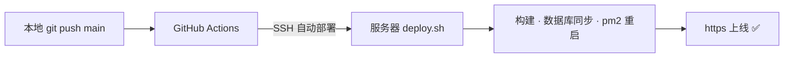

# 拾页书阁 · MyBlog

> 像书一样的个人博客 —— 把每一篇 Markdown 装订成可以翻阅的章节。
> A book-like personal blog — every Markdown is bound into readable chapters.

## 📖 选择语言 / Choose Your Language

| 语言 / Language | 文档 / Documentation |
|------|------|
| 🇨🇳 中文 | [**README.zh-CN.md**](./README.zh-CN.md) |
| 🇬🇧 English | [**README.en.md**](./README.en.md) |

设计文档 / Design doc: [`MyBlog框架设计文档.md`](./MyBlog框架设计文档.md)

## ⚡ 亮点 / Highlights

- 📚 书页式阅读 · 句子书注 · 书籍搜索 · AI 知识问答（RAG 引用溯源）
- 🎭 Live2D 动态小人（本地模型 + 点击问答气泡）
- 🚀 **推送即上线**：GitHub Actions 自动部署（[deploy/README.md](./deploy/README.md)）

---

*本项目由 AI 辅助开发 / This project was developed with AI assistance.*
